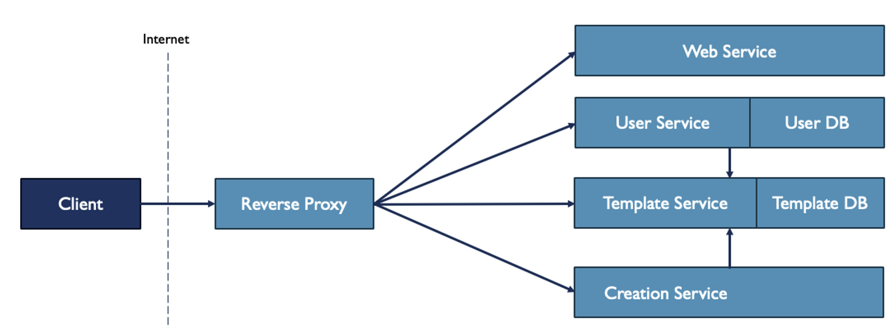

# PDF-Designer

Mit dem Projekt PDF Designer ist es möglich PDFs anhand eines selbst erstellten Templates erstellen zu können.\
Diese werden dann dynamisch mit Daten gefüllt. Z.B. Rechnungsstellung oder Auflistung von Daten in einer Tabelle.

## Authors
Hauke Ingwersen\
hauke.ingwersen@stud.hs-flensburg.de\
Hochschule Flensburg

Robert Pfeiffer\
robert.pfeiffer@stud.hs-flensburg.de\
Hochschule Flensburg

Jannes Nebendahl\
jannes.nebendahl@stud.hs-flensburg.de\
Hochschule Flensburg

## TODO

# Aktuelles Architekturbild

