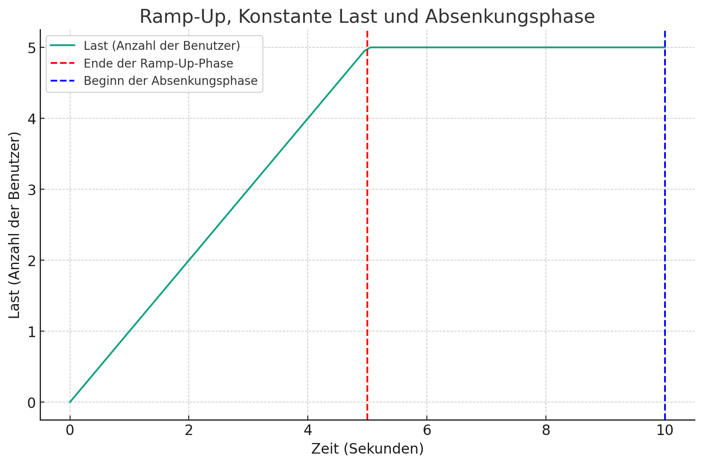

# Run loadtest:
```go run main.go```

# Config-File:

```
{
    "users": 5,
    "rampup": 5,
    "duration": 5,
    "cooldown": 1,
    "target": "localhost:8000",
    "path": "/api/",
    "targets": [
        "localhost:8000"
    ],
    "paths": [
        "/api/template1",
        "/api/template2"
    ]
}
```

# Diagram:



