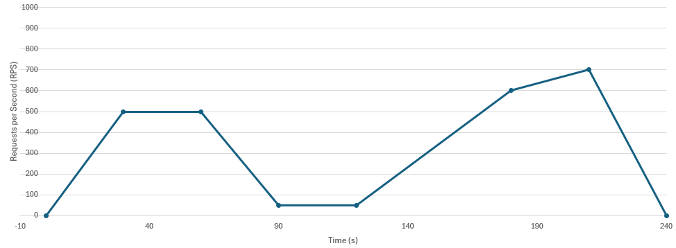
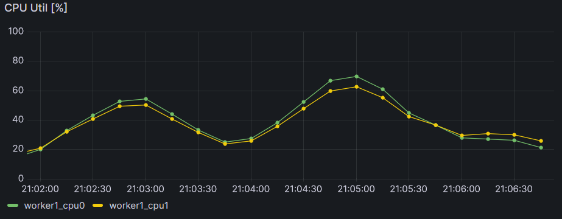

# Config-File:

With this loadtest you can should a desired Number of Request per Second (RPS) against the target. You can the define the Number of RPS as a curve. To do so you have define points with `targetRPS`. The test will linear interpolate the RPS to this `targetRPS` in a duration of `seconds2Target` after it has reached the previous `targetRPS`. The Test starts with 0 RPS and will stop with last ``targetRPS`.

The following example shows how you have setup the config.json file to achieve the following curve:


```
{
    "curve": [
        {"seconds2TargetRPS": 30, "targetRPS": 500},
        {"seconds2TargetRPS": 30, "targetRPS": 500},
        {"seconds2TargetRPS": 30, "targetRPS": 50},
        {"seconds2TargetRPS": 30, "targetRPS": 50},
        {"seconds2TargetRPS": 30, "targetRPS": 600},
        {"seconds2TargetRPS": 30, "targetRPS": 700},
        {"seconds2TargetRPS": 30, "targetRPS": 0}
    ],
    "target": "192.168.178.98:31153",
    "paths": [
        "/admin",
        "/api"
    ]
}
```

Replace the target with the target address of your api-gateway service.

Depending on the available resources of your kubernetes cluster you won't be able to see the exact same curve in your monitoring tool as you have defined it in the config file. But you will be able to notice an increase and decrease in the performance with an increasing and decreasing number of RPS. Like you can see it in the following picture:  


# Run loadtest:

To run the load test just run `go run main.go`
