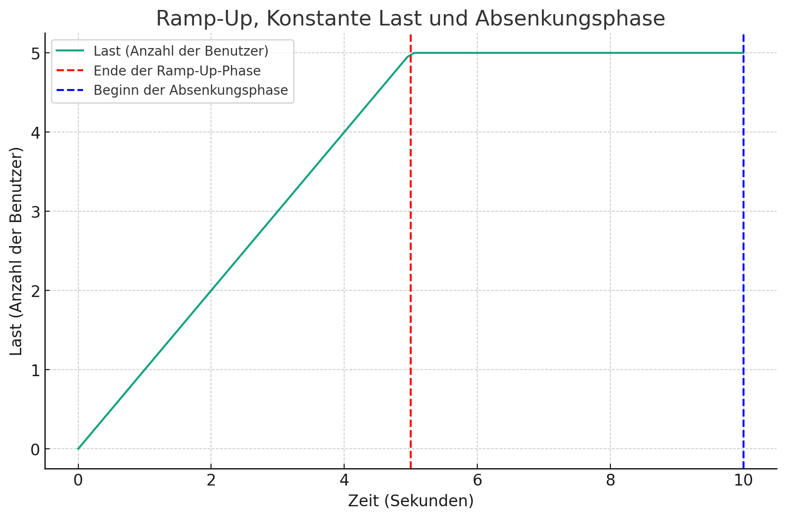

# Run loadtest:

`go run main.go`

* *targetRPS* stands for the target Requests Per Second. 

# Config-File:

```
{
    "rampSpecifications": [
        {"duration": 5, "targetRPS": 5},
        {"duration": 5, "targetRPS": 5},
        {"duration": 5, "targetRPS": 5}
    ],
    "target": "192.168.178.98:31153",
    "paths": [
        "/admin",
        "/api"
    ]
}
```

# Diagram:


